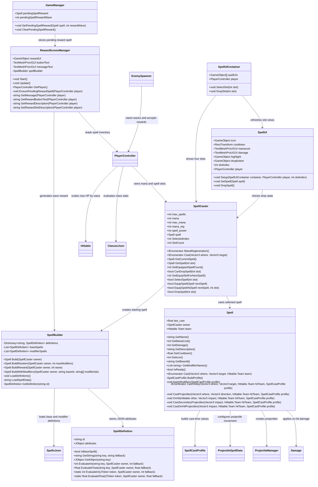

# CMPM 121 Assignment 3 Report

## Architecture Diagram

## Architecture Description

Spell data is loaded from `Assets/Resources/spells.json` into `SpellDefinition` objects. `SpellBuilder` separates base spells from modifier spells, builds the player's starting Arcane Bolt, and generates random reward spells by combining one base spell with a random list of modifier definitions.

`Spell` is a data-driven runtime spell rather than a MonoBehaviour. When cast, it builds a `SpellCastProfile` from the base definition, evaluates RPN expressions with the current `wave` and player `power`, then applies each modifier in order. The profile controls damage, mana cost, cooldown, projectile speed, projectile trajectory, repeated casts, split volleys, secondary projectiles, and custom on-hit projectiles.

The player now owns a `SpellCaster` with up to four spell slots. `SpellUIContainer` keeps the four slot UIs visible and synchronized with the inventory, while `SpellUI` shows each slot's icon, mana cost, damage, cooldown, highlight state, and drop button. The reward screen stores a pending reward in `GameManager`, previews its stats, and shows the slot where the reward will be equipped or the spell it will replace. `EnemySpawner.NextWave` accepts the pending reward before starting the next wave.

Player progression is loaded from `classes.json`. `PlayerController.ApplyWaveStats` evaluates the mage class expressions for HP, mana, mana regeneration, spell power, and speed each wave, preserving current HP and mana percentages when the maximum values change.

## New Spells

- `damage_amp`: increases spell damage and mana cost multiplicatively.
- `speed_amp`: increases projectile speed multiplicatively.
- `doubler`: casts the modified spell a second time after a short delay, with higher mana cost and cooldown.
- `splitter`: casts the modified spell in two nearby directions.
- `chaos`: increases damage and changes the projectile trajectory to spiraling.
- `homing`: changes the projectile trajectory to homing while reducing damage and adding mana cost.
- `mana_stream`: an added modifier that lowers mana cost with a small cooldown penalty.
- `overclocked`: an added modifier that reduces cooldown and increases projectile speed, but costs more mana.
- `nova_burst`: an added behavior modifier that releases extra arcane shards from the hit point.

Optional base spells from the assignment are also supported: Magic Missile uses homing projectiles, Arcane Spray creates a cone of short-lived bolts, and Arcane Blast creates secondary projectiles when it hits.

## Contributions

Todd Crandell implemented the JSON-driven spell definition pipeline, modifier evaluation, reward generation, player stat scaling, and the final reward-slot/drop polish. The main lesson was how much cleaner spell behavior becomes when the cast path builds a temporary profile from data instead of baking every variation into separate classes.

ValerieVATS expanded the player spell system from a single spell into multiple spell slots and added the visible slot UI with selection and drop affordances. The main lesson was keeping gameplay state and UI state synchronized without letting the UI become the source of truth.
